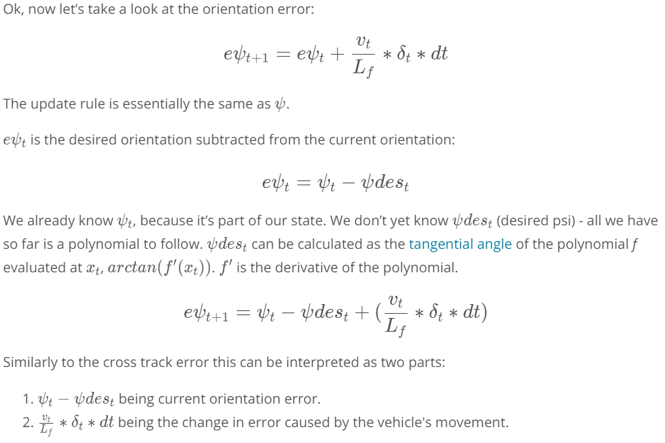

## Kinematic Models
Kinematic models are simplifications of dynamic models that ignore tire forces, gravity, and mass.

This simplification reduces the accuracy of the models, but it also makes them more tractable.

At low and moderate speeds, kinematic models often approximate the actual vehicle dynamics.

## Dynamic Models
Dynamic models aim to embody the actual vehicle dynamics as closely as possible.

They might encompass tire forces, longitudinal and lateral forces, inertia, gravity, air resistance, drag, mass, and the geometry of the vehicle.

Not all dynamic models are created equal! Some may consider more of these factors than others.

Advanced dynamic models even take internal vehicle forces into account - for example, how responsive the chassis suspension is.


## Kinematic bicycle model
States: $[x,y,\psi,v]$

Inputs:
* Steering angle: $ψ$
* Throttle/brake: $a$

Predictions:

>$x_{t+1} = x_{t} + v_{t} \cdot cos(\psi_t) \cdot dt $
>
>$y_{t+1} = y_{t} + v_{t} \cdot sin(\psi_t) \cdot dt $
>
>$\psi_{t+1} = \psi_{t} + \frac{v_{t}}{L_f} \cdot \delta \cdot dt $
>
>$v_{t+1} = v_{t} + \cdot a_t \cdot dt $


$L_f$ measures the distance between the center of mass of the vehicle and it's front axle. The larger the vehicle, the slower the turn rate.

## How to chose $L_f$ 


On the topic of running a vehicle around in a circle, this is actually a good way to test the validity of a model! If the radius of the circle generated from driving the test vehicle around in a circle with a constant velocity and steering angle is similar to that of your model in the simulation, then you're on the right track. This type of approach was used to tune $L_f$


​

## // Global kynematic model in c++
```
// In this quiz you'll implement the global kinematic model.
#include <math.h>
#include <iostream>
#include "Dense"

using Eigen::VectorXd;

//
// Helper functions
//
constexpr double pi() { return M_PI; }
double deg2rad(double x) { return x * pi() / 180; }
double rad2deg(double x) { return x * 180 / pi(); }

const double Lf = 2;

// Return the next state.
VectorXd globalKinematic(const VectorXd &state, 
                         const VectorXd &actuators, double dt);

int main() {
  // [x, y, psi, v]
  VectorXd state(4);
  // [delta, v]
  VectorXd actuators(2);

  state << 0, 0, deg2rad(45), 1;
  actuators << deg2rad(5), 1;

  // should be [0.212132, 0.212132, 0.798488, 1.3]
  auto next_state = globalKinematic(state, actuators, 0.3);

  std::cout << next_state << std::endl;
}

VectorXd globalKinematic(const VectorXd &state, 
                         const VectorXd &actuators, double dt) {
  // Create a new vector for the next state.
  VectorXd next_state(state.size());
  next_state(0) = state[0] + state[3]* cos(state[2]) * dt;
  next_state(1) = state[1] + state[3]* sin(state[2]) * dt ;
  next_state(2) = state[2] + (state[3] * actuators[0] / Lf)*dt; 
  next_state(3) = state[3] + actuators[1]*dt ;
  
  // NOTE: state is [x, y, psi, v] and actuators is [delta, a]

  return next_state;
}
```

***

## Following Trajetories

This polynomial is usually 3rd order, since third order polynomials will fit trajectories for most roads. 


### Fit a plynomial an then evaluete it to see the path
```
#include <iostream>
#include "Dense"

using Eigen::VectorXd;

// Evaluate a polynomial.
double polyeval(const VectorXd &coeffs, double x);
// Fit a polynomial.
VectorXd polyfit(const VectorXd &xvals, const VectorXd &yvals, int order);

int main() {
  VectorXd xvals(6);
  VectorXd yvals(6);
  // x waypoint coordinates
  xvals << 9.261977, -2.06803, -19.6663, -36.868, -51.6263, -66.3482;
  // y waypoint coordinates
  yvals << 5.17, -2.25, -15.306, -29.46, -42.85, -57.6116;
  
  VectorXd out(6);
   out = polyfit(xvals,yvals,3);
  
  
  

  for (double x = 0; x <= 20; ++x) {
    std::cout << polyeval(out,x) << std::endl; 
  }

  // Expected output
  // -0.905562
  // -0.226606
  // 0.447594
  // 1.11706
  // 1.7818
  // 2.44185
  // 3.09723
  // 3.74794
  // 4.39402
  // 5.03548
  // 5.67235
  // 6.30463
  // 6.93236
  // 7.55555
  // 8.17423
  // 8.7884
  // 9.3981
  // 10.0033
  // 10.6041
  // 11.2005
  // 11.7925
}

double polyeval(const VectorXd &coeffs, double x) {
  double result = 0.0;
  for (int i = 0; i < coeffs.size(); ++i) {
    result += coeffs[i] * pow(x, i);
  }
  return result;
}

// Adapted from:
// https://github.com/JuliaMath/Polynomials.jl/blob/master/src/Polynomials.jl#L676-L716
VectorXd polyfit(const VectorXd &xvals, const VectorXd &yvals, int order) {
  assert(xvals.size() == yvals.size());
  assert(order >= 1 && order <= xvals.size() - 1);

  Eigen::MatrixXd A(xvals.size(), order + 1);

  for (int i = 0; i < xvals.size(); ++i) {
    A(i, 0) = 1.0;
  }

  for (int j = 0; j < xvals.size(); ++j) {
    for (int i = 0; i < order; ++i) {
      A(j, i + 1) = A(j, i) * xvals(j);
    }
  }

  auto Q = A.householderQr();
  auto result = Q.solve(yvals);

  return result;
}
```

## MPC

The new state is $[x,y,ψ,v,cte,eψ]$


## Cross Track Error


## Orientation error



## Models comparison 
Lower complexity models have two strong advantages over higher complexity (dynamic included) models. They can run in real time (essential requirement of any model operating in a vehicle) and they are transferable to vehicles with differing attributes, such as mass. To use a dynamic model engineers would have to be able to control the vehicle attributes of the vehicles they are deploying models into (they probably won't have control over this). High complexity models would need major re-adjustment to account for even small differences. Lower complexity models do not suffer from this constraint and so can be placed in a wider range of vehicles, with far less additional effort, and unpredictability.


## Dynamic models


>$F_x = fx_1 + fx_2 +fx_3 + fx_4$
>$F_y = fy_1 + fy_2 +fy_3 + fy_4$


 ## Slip angle

 


  ## Slip ratio


## Tire models


* Pacejka Tire Model - Magic tyre model
* [A brief overview of essential topics in vehicle dynamics](http://www.springer.com/cda/content/document/cda_downloaddocument/9783658039776-c1.pdf?SGWID=0-0-45-1468312-p176308738)

* [An excellent book This is not a free resource but is highly recommended by domain experts.](http://www.springer.com/us/book/9781461414322)

## Cosntraints

Steering angle: [-30º - 30º]

Acceleration: [-1 , 1]