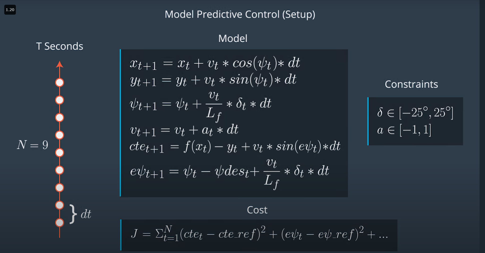

# Model Predictive Control - MPC
### Receding Horizon Control
***

A good start to the cost function is to think of the error that you would like to minimize. For example, measuring the offset from the center of the lane, where the center of the lane can be called the reference, or desired, state.

We previously captured two errors in our state vector: $cte$ and $e\psi$.

Ideally, both of these errors would be 0 - there would be no difference from the actual vehicle position and heading to the desired position and heading.

Here’s one such example of how to increment our cost at each timestep, tt, over our desired time horizon (represented by total number of desired timesteps, NN, below) - we want to minimize the total error accumulated over this time horizon:
```
double cost = 0;
for (int t = 0; t < N; ++t) {
  cost += pow(cte[t], 2);
  cost += pow(epsi[t], 2);
}
```

```
for (int t = 0; t < N-1; ++t) {
  cost += pow(delta[t], 2);
}


for (int t = 0; t < N-1; ++t) {
  cost += pow(delta[t+1] - delta[t], 2);
  cost += pow(a[t+1] - a[t], 2);
}
```

The prediction horizon is the duration over which future predictions are made. We’ll refer to this as T. Being $N$ number of timesteps:

$T = N \cdot dt$

## Horizon
In the case of driving a car, T should be a few seconds, at most. Beyond that horizon, the environment will change enough that it won't make sense to predict any further into the future.

## Number of Timesteps

Thus N determines the number of variables optimized by the MPC. This is also the major driver of computational cost.


Larger values of dt result in less frequent actuations, which makes it harder to accurately approximate a continuous reference trajectory. This is sometimes called "discretization error".


## Timestep Duration
A good approach to setting N, dt, and T is to first determine a reasonable range for T and then tune dt and N appropriately, keeping the effect of each in mind.



## Latency

In a real car, there will be a delay as the command propagates through the system. A realistic delay might be on the order of 100 milliseconds.

A contributing factor to latency is actuator dynamics. For example the time elapsed between when you command a steering angle to when that angle is actually achieved. This could easily be modeled by a simple dynamic system and incorporated into the vehicle model. One approach would be running a simulation using the vehicle model starting from the current state for the duration of the latency. The resulting state from the simulation is the new initial state for MPC.

Thus, MPC can deal with latency much more effectively, by explicitly taking it into account, than a PID controller.


## Extra resources

* [Vision-Based High Speed Driving with a Deep Dynamic Observer](https://arxiv.org/abs/1812.02071)
* [Reinforcement Learning and Deep Learning based Lateral Control for Autonomous Driving](https://arxiv.org/abs/1810.12778)

The below paper shows one of the techniques Waymo has researched using imitation learning (aka behavioral cloning) to drive a car.

* [ChauffeurNet: Learning to Drive by Imitating the Best and Synthesizing the Worst](https://arxiv.org/abs/1812.03079)
 