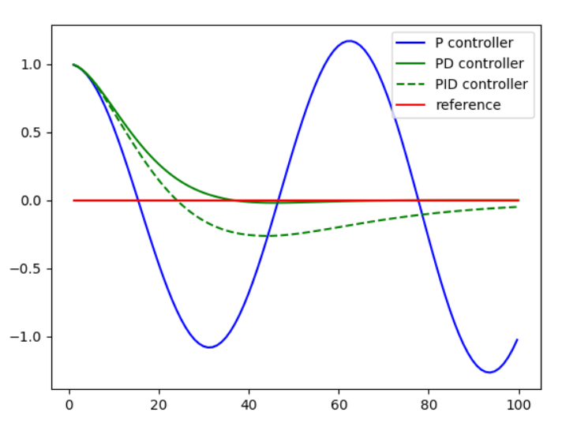
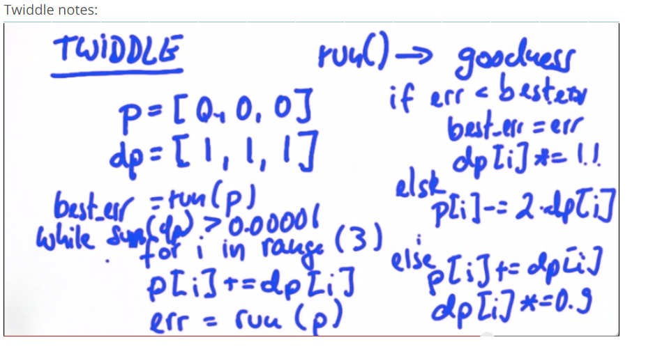

# PID controller

##  Summary


Implementation
```
def run(robot, tau_p, tau_d, tau_i, n=100, speed=1.0):
    x_trajectory = []
    y_trajectory = []
    prev_cte = robot.y
    int_cte = 0
    for i in range(n):
        cte = robot.y
        diff_cte = cte - prev_cte
        prev_cte = cte
        int_cte += cte
        steer = -tau_p * cte - tau_d * diff_cte - tau_i * int_cte
        robot.move(steer, speed)
        x_trajectory.append(robot.x)
        y_trajectory.append(robot.y)
    return x_trajectory, y_trajectory
```


## Twiddle parameter optimization (coordinate ascent)




Implementation

```
 while sum(dp) > 0.00001:
        for i in range(len(p)):
            p[i] += dp[i]
            robot = make_robot()
            x_trajectory, y_trajectory, err = run(robot, p)
            if err  <  best_err:
                best_err = err
                dp[i] *=2
            else:
                p[i] -= 2*dp[i]
                robot = make_robot()
                x_trajectory, y_trajectory, err = run(robot, p)
                if err  <  best_err:
                    best_err = err
                    dp[i] *=1.1
                else:
                    p[i] += dp[i]
                    dp[i] *=0.9
    robot = make_robot()
    x_trajectory, y_trajectory, best_err = run(robot, p)
```

***
## Other papers of interest

* [Vision-Based High Speed Driving with a Deep Dynamic Observer](https://arxiv.org/abs/1812.02071)
* [Reinforcement Learning and Deep Learning based Lateral Control for Autonomous Driving](https://arxiv.org/abs/1810.12778)

* [ChauffeurNet: Learning to Drive by Imitating the Best and Synthesizing the Worst ](https://arxiv.org/abs/1812.03079)